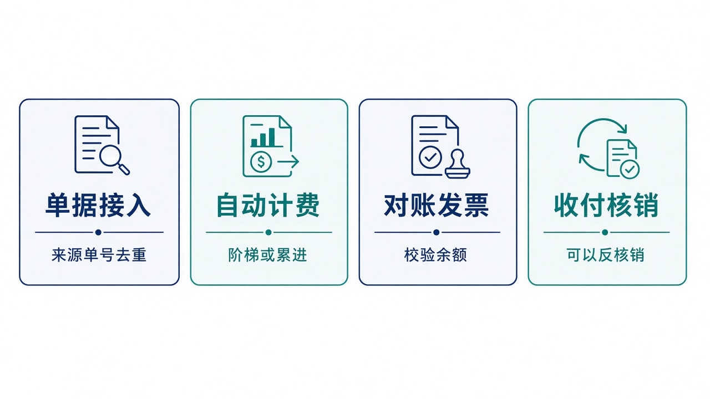
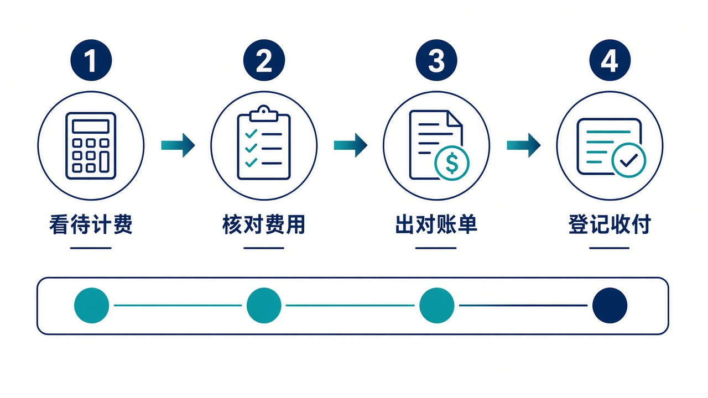

# 给大家讲：结算系统怎么用

BMS 把仓储、运输、订单单据变成应收和应付。费率在合同里。控制塔只能读成本，不能在这里改费率、冲销或核销。亮点短表见 [项目亮点](./项目亮点.md)。

## 适合什么场景

| 场景 | 在这里怎么做 |
| --- | --- |
| 仓库、运输或订单完成了一笔业务 | 按来源加外部单号推送。重复推送不会再出一张费用 |
| 合同是阶梯价或分段累进 | 费率按单、件、重量、体积、里程或天计算，并受最低、最高收费约束 |
| 月底要跟客户或承运商对账 | 生成对账单。草稿期可以调整，确认后走争议或结清 |
| 要开发票、要收款付款 | 发票登记会校验对账单余额。收付款可以核销，也可以反核销 |
| 控制塔问这笔运费多少钱 | 按日期拉未作废费用。有结算运费的订单，控制塔汇总优先用这笔 |

## 亮点

1. 一张费率能表达固定、单价、整段阶梯和分段累进。
2. 从费用走到对账单、发票和收付款，过程留在同一套账上。
3. 工作台能看到待计费、逾期和即将到期的合同。
4. 给控制塔的是成本快照，不是第二本可以改的账。

## 一天怎么用

1. 看工作台的待计费和计费失败。
2. 核对自动费用。不对就重算，不要到控制塔里改金额。
3. 按结算对象和期间出对账单。
4. 登记发票和收付款，核销到结清。

页面上的毛利来自本系统费用。控制塔指令上的预计节约不要当成已经入账的利润。
