# BMS 结算管理系统 项目汇报

> 汇报口径：截至 2026-09-23 的 `main`（PR #1 ~ #18，最新 Release `v20260923-08dd103`）。
> 配套阅读：[项目亮点](./项目亮点.md) · [图文导读](./图文导读.md) · [技术方案](./技术方案.md) · [README](../README.md)

---

## 1. 项目背景与目标

OTWB 供应链平台已有 OMS（订单）、WMS（仓储）、TMS（运输）三套业务系统，但"业务完成后该向客户收多少钱、该付承运商多少钱"一直依赖线下 Excel 对账，存在算法口径不一、重复计费、对账周期长、经营数据滞后等问题。

BMS（Billing Management System）的目标是成为平台的**计费与结算中枢**：

| 目标 | 做法 |
| --- | --- |
| 费率从 Excel 搬进合同 | 应收 AR / 应付 AP 合同 + 费率规则，支持固定、单价、阶梯、累进、首重续重 |
| 业务单据自动变成费用 | WMS/TMS/OMS 推送、CSV 导入、手工录入统一接入，幂等、自动计费 |
| 从费用走到钱 | 对账单 → 发票 → 收付款核销，全过程在同一套账上 |
| 经营数据即时可见 | 工作台 + 收入/成本/毛利、账龄、结算对象台账 |
| 向控制塔输出成本 | 只读的成本快照接口，不给第二本可改的账 |

---

## 2. 系统全貌

### 2.1 系统定位

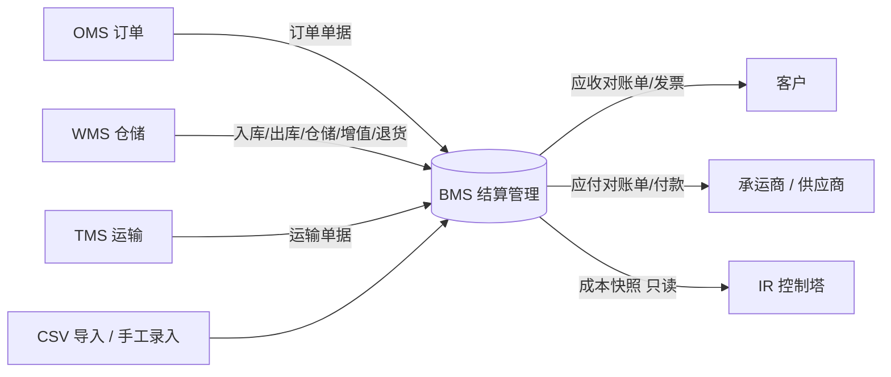
```mermaid
flowchart LR
    OMS[OMS 订单] -->|订单单据| BMS
    WMS[WMS 仓储] -->|入库/出库/仓储/增值/退货| BMS
    TMS[TMS 运输] -->|运输单据| BMS
    CSV[CSV 导入 / 手工录入] --> BMS
    BMS[(BMS 结算管理)] -->|应收对账单/发票| CUST[客户]
    BMS -->|应付对账单/付款| CARRIER[承运商 / 供应商]
    BMS -->|成本快照 只读| IR[IR 控制塔]
```

### 2.2 技术架构

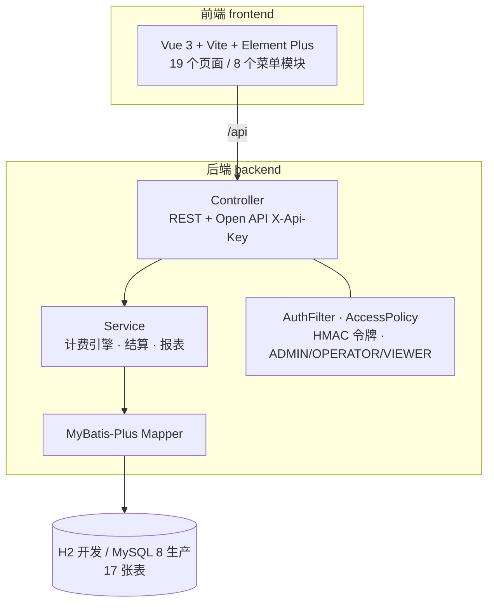
```mermaid
flowchart TB
    subgraph 前端 frontend
        V[Vue 3 + Vite + Element Plus<br/>19 个页面 / 8 个菜单模块]
    end
    subgraph 后端 backend
        C[Controller<br/>REST + Open API X-Api-Key]
        S[Service<br/>计费引擎 · 结算 · 报表]
        M[MyBatis-Plus Mapper]
        A[AuthFilter · AccessPolicy<br/>HMAC 令牌 · ADMIN/OPERATOR/VIEWER]
    end
    DB[(H2 开发 / MySQL 8 生产<br/>17 张表)]
    V -->|/api| C --> S --> M --> DB
    C --- A
```

| 层 | 技术 | 说明 |
| --- | --- | --- |
| 后端 | Java 17、Spring Boot 2.7.18、MyBatis-Plus 3.5.3.1 | 与 OMS/WMS/TMS 同构，76 个 Java 类 |
| 前端 | Vue 3、Vite、Element Plus、Vue Router、Axios | 19 个页面，前端可打包进后端单 JAR |
| 数据库 | H2（开发，零配置）/ MySQL 8（生产） | `schema.sql` 幂等建表 + 启动期迁移 |
| 认证 | Bearer Token（HMAC-SHA256） | 三种角色，`/api/system/**` 仅管理员 |
| 交付 | GitHub Actions 自动 Release | 单 JAR、便携包（Win/Mac/Linux）、捆绑 JRE 原生包（含 Apple Silicon） |

### 2.3 数据模型

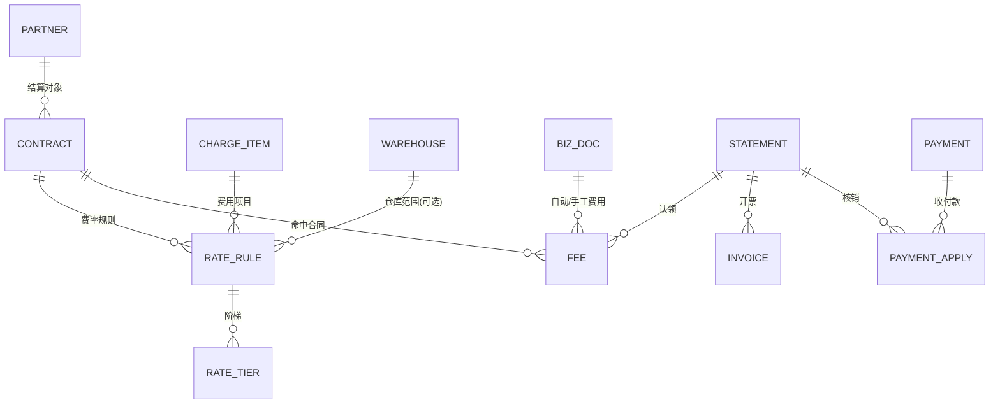
```mermaid
erDiagram
    PARTNER ||--o{ CONTRACT : "结算对象"
    CONTRACT ||--o{ RATE_RULE : "费率规则"
    RATE_RULE ||--o{ RATE_TIER : "阶梯"
    CHARGE_ITEM ||--o{ RATE_RULE : "费用项目"
    WAREHOUSE ||--o{ RATE_RULE : "仓库范围(可选)"
    BIZ_DOC ||--o{ FEE : "自动/手工费用"
    CONTRACT ||--o{ FEE : "命中合同"
    STATEMENT ||--o{ FEE : "认领"
    STATEMENT ||--o{ INVOICE : "开票"
    STATEMENT ||--o{ PAYMENT_APPLY : "核销"
    PAYMENT ||--o{ PAYMENT_APPLY : "收付款"
```

---

## 3. 核心业务流程

### 3.1 主链路：单据 → 费用 → 对账 → 发票 → 收付款

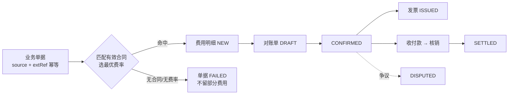
```mermaid
flowchart LR
    D[业务单据<br/>source + extRef 幂等] --> R{匹配有效合同<br/>选最优费率}
    R -->|命中| F[费用明细 NEW]
    R -->|无合同/无费率| X[单据 FAILED<br/>不留部分费用]
    F --> ST[对账单 DRAFT]
    ST --> CF[CONFIRMED]
    CF --> INV[发票 ISSUED]
    CF --> PAY[收付款 → 核销]
    PAY --> SET[SETTLED]
    CF -.争议.-> DIS[DISPUTED]
```

### 3.2 状态机

| 对象 | 状态流转 |
| --- | --- |
| 业务单据 | `PENDING → BILLED / FAILED / IGNORED`，失败可重算 |
| 费用 | `NEW → STATEMENTED → SETTLED`，可 `CANCELLED` |
| 对账单 | `DRAFT → CONFIRMED → SETTLED`，可 `DISPUTED / CANCELLED`，取消释放费用 |
| 发票 | `ISSUED → CANCELLED`，开票金额不得超对账单余额 |
| 收付款 | 登记 → 核销 → 反核销，方向和结算对象必须与对账单一致 |

### 3.3 费率计算能力

| 计价模式 | 说明 | 示例 |
| --- | --- | --- |
| FIXED 固定 | 每单固定 | 订单处理费 2 元/单 |
| UNIT 单价 | 数量 × 单价 | 入库操作费 0.5 元/件 |
| TIERED 整段阶梯 | 落在哪一段按该段单价全量计 | 0~10 件 0.5，10~100 件 0.3 |
| PROGRESSIVE 分段累进 | 各段分别计价累加 | 运费 0~1kg 8 元，1~10kg 2 元/kg |
| FIRST_EXTRA 首重续重 | 首重整段收，超出乘续重单价 | 首重 1kg 12 元、续重 2 元，3.5kg = 17 元 |

计费单位覆盖单、行、件、箱、托、重量、体积、里程、托·天、方·天、件·天；每条规则可设最低/最高收费、优先级和仓库范围。同合同同费用项目只取一条最优规则：优先级高者胜出，同优先级仓库专用规则优先。

---

## 4. 功能展示（系统截图）

> 以下截图取自开发环境演示数据（管理员登录）。

### 4.1 工作台

本月应收/应付/毛利、应收未收、逾期对账单、计费失败单据、未对账金额一屏可见。

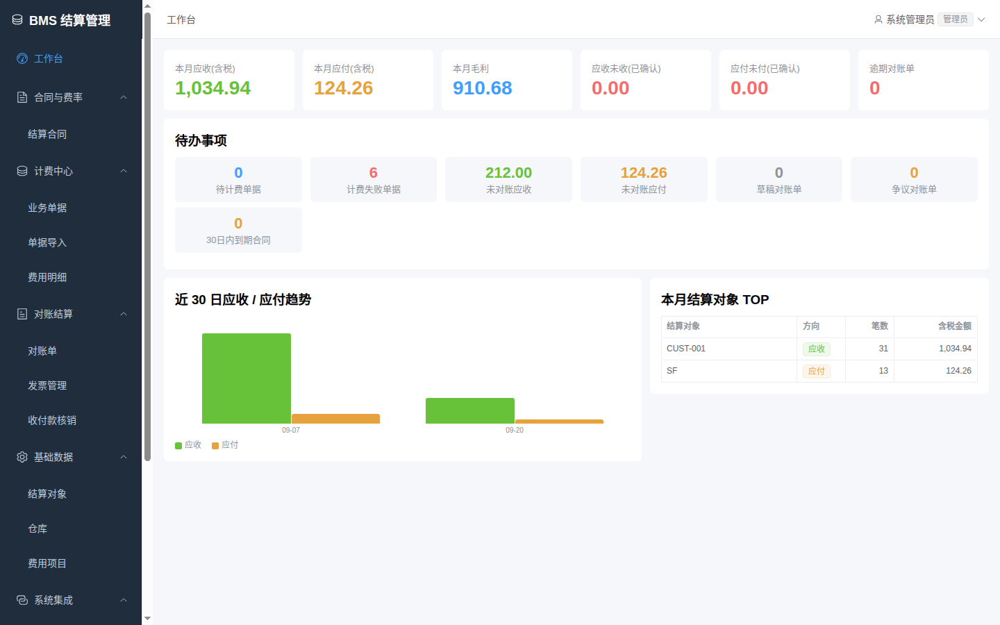

### 4.2 合同与费率

合同列表按方向（AR/AP）、状态筛选；合同详情维护税率、账期、结算周期和费率规则，已生效合同修改费率有告警。

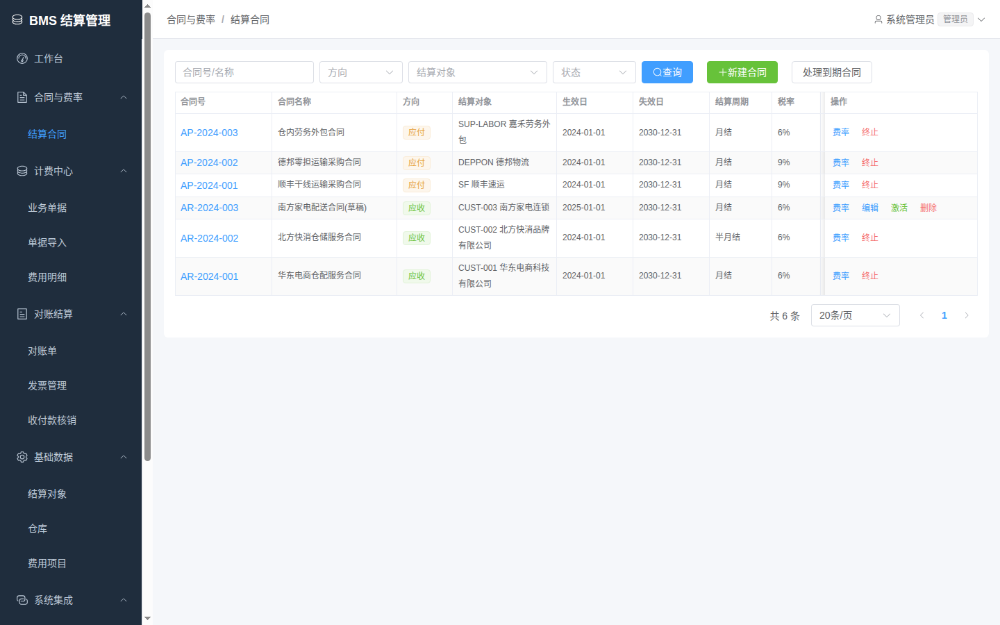

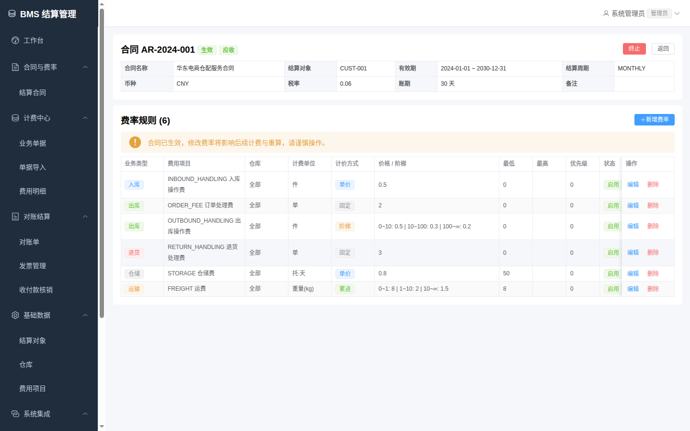

### 4.3 计费中心

业务单据统一列表（来源、业务类型、计费状态、应收/应付金额），失败单据可一键重算；单据详情展示计费过程和每条费用命中的规则。

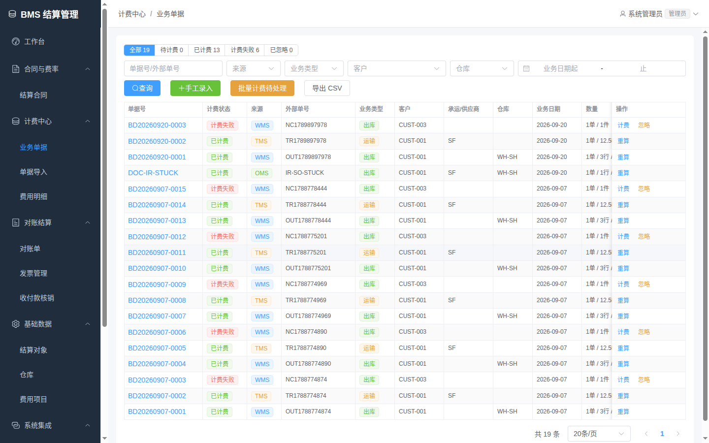

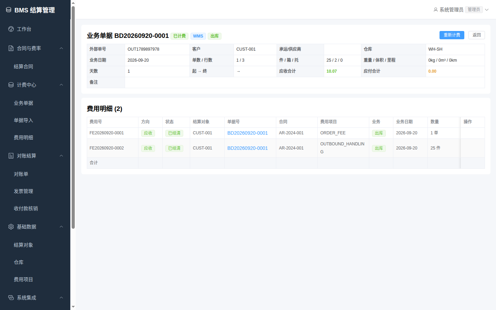

CSV 批量导入（支持引号字段、多行字段、UTF-8 BOM），以及费用明细的查询、手工新增和取消。

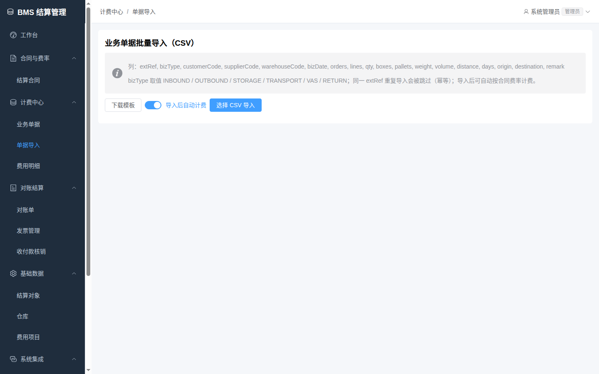

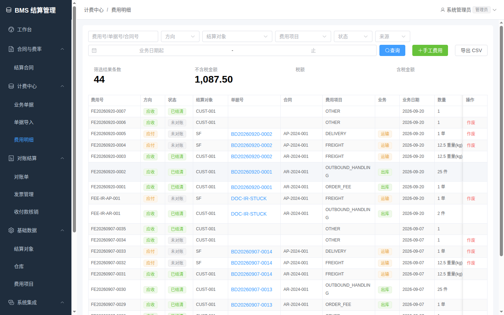

### 4.4 对账结算

按结算对象和期间生成对账单（支持批量），草稿期可调整，确认后进入开票与收付款。

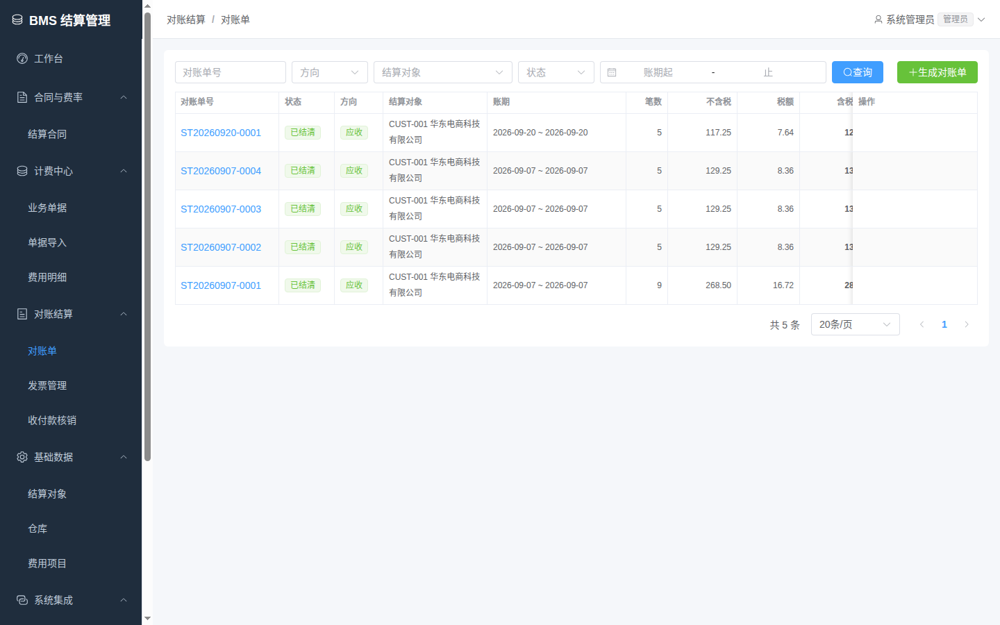

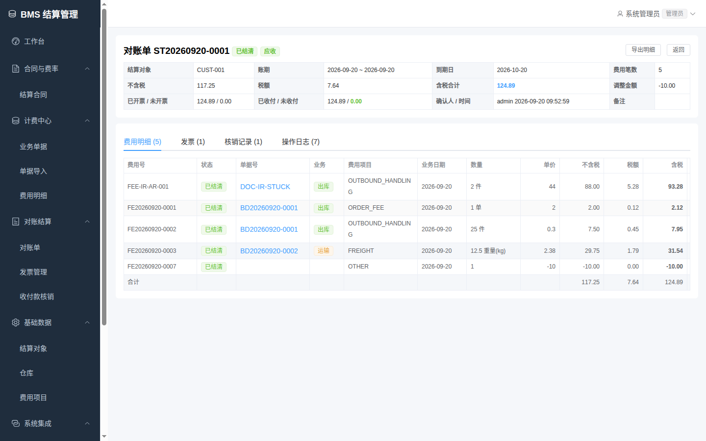

发票登记校验对账单余额；收付款登记后核销到对账单，支持反核销。

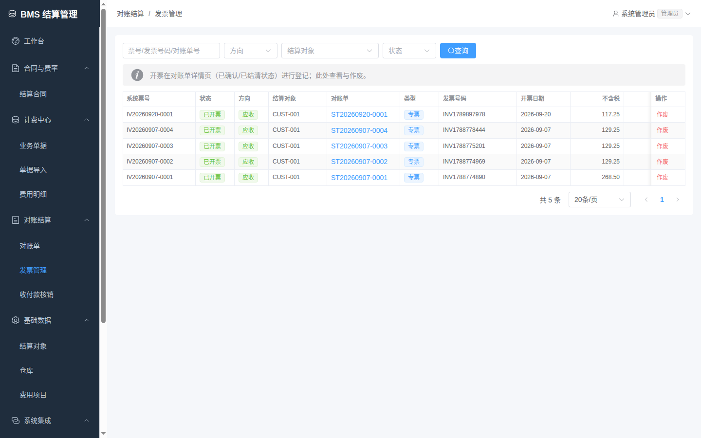

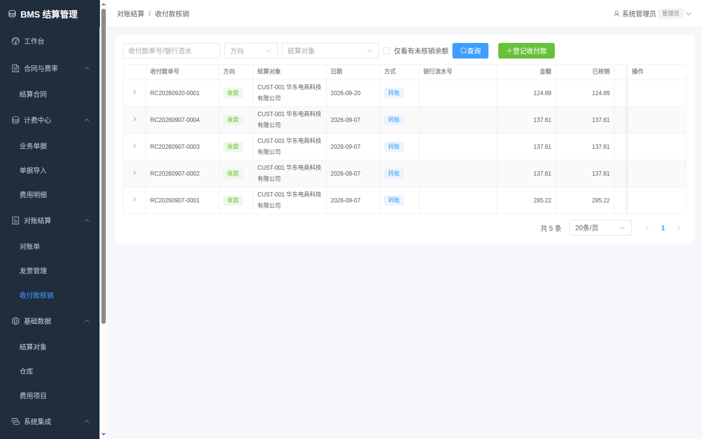

### 4.5 报表分析

收入/成本/毛利、费用汇总（对象×项目）、费用项目构成、账龄分析、结算对象台账五个视图。

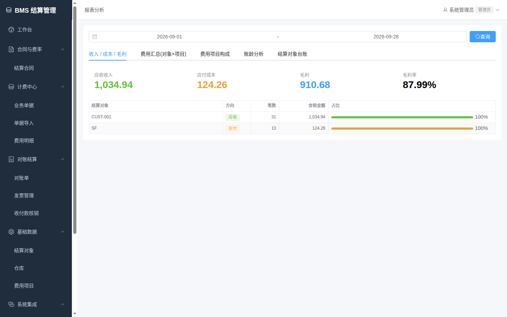

### 4.6 基础数据、系统集成与系统管理

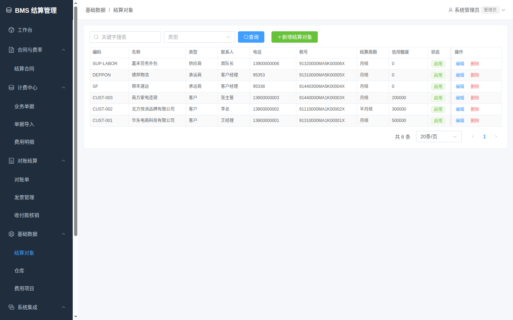

Open API 接入说明内置在系统中，接口日志记录每次上游推送的请求、结果与耗时。

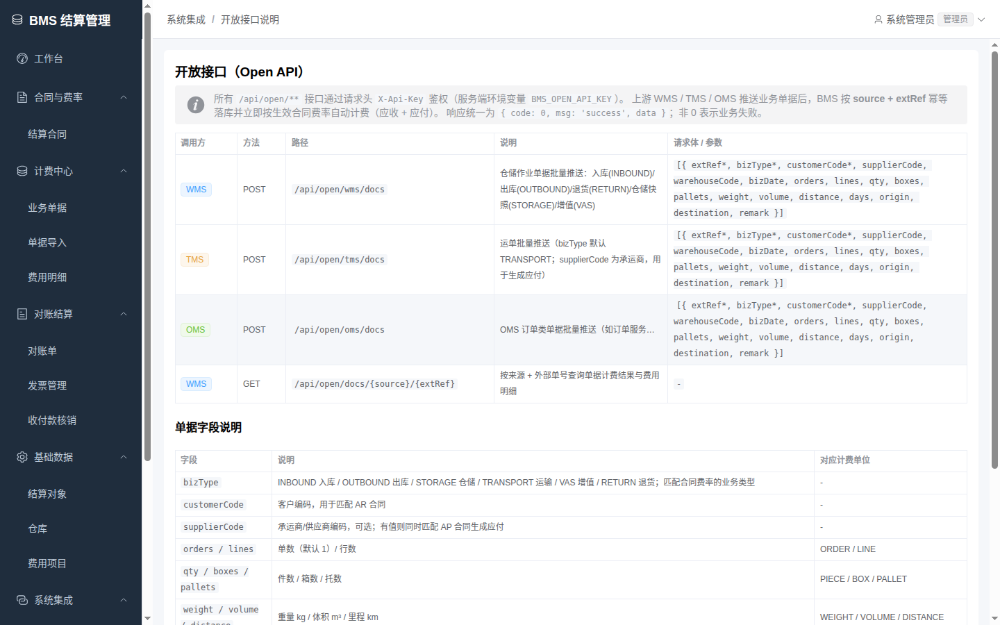

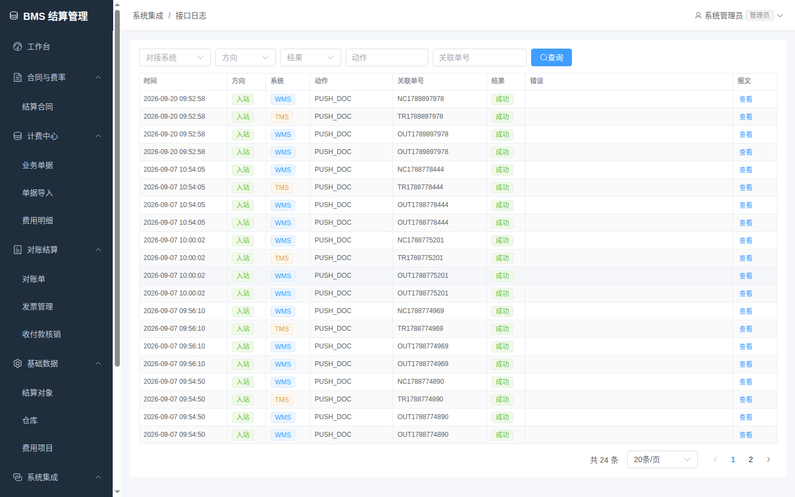

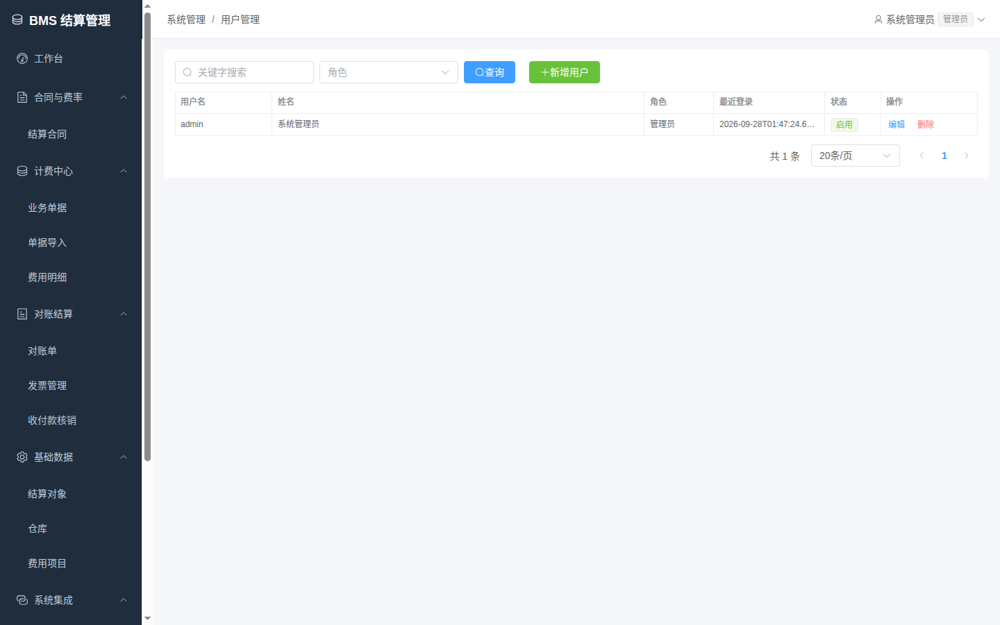

---

## 5. 对外接口

| 方向 | 接口 | 说明 |
| --- | --- | --- |
| 上游写入 | `POST /api/open/wms/docs` | WMS 入库/出库/仓储/增值/退货单据 |
| 上游写入 | `POST /api/open/tms/docs` | TMS 运输单据，缺 `bizType` 默认 `TRANSPORT` |
| 上游写入 | `POST /api/open/oms/docs` | OMS 订单单据 |
| 控制塔读取 | `GET /api/open/cost/records?from&to` | 按业务日返回未作废费用 |
| 控制塔读取 | `GET /api/open/ir/snapshots` | 成本快照（`dataType=COST`） |

鉴权使用 `X-Api-Key`。BMS **不实现**控制塔的写指令接口，控制塔不能在此改费率、冲销或核销。

---

## 6. 工程质量

### 6.1 测试

| 类型 | 内容 | 结果 |
| --- | --- | --- |
| 后端单元/流程测试 | 9 个测试类、29 个用例：计费引擎、全链路流程、并发/幂等回归、Open IR、声明金额、鉴权与令牌 | `mvn test` 全部通过 |
| 冒烟脚本 | `scripts/smoke.sh`：登录 → 基础数据 → 合同 → WMS/TMS 推送 → 计费 → 幂等 → 对账 → 开票 → 核销 → 报表 | `SMOKE OK` |
| 前端 | `npm run build` | 通过 |
| CI/CD | 默认分支冒烟通过后自动发布 GitHub Release | 已发布 3 个版本 |

### 6.2 代码评审中发现并修复的问题

项目全程接受自动代码评审，两轮评审共修复以下关键问题：

| 问题 | 修复 |
| --- | --- |
| 计费失败时残留部分费用可进入对账单 | 失败即删除本单自动费用，单据置 FAILED |
| 并发推送同一 `(source, extRef)` 产生重复单据 | 唯一索引 + 先查后插；升级库启动期自动迁移，存在历史重复数据时拒绝启动 |
| 并发生成对账单共享同一费用 | 逐条条件更新认领费用 |
| 开票 / 核销 / 反核销并发下余额错扣 | 行锁 + 条件更新，删除/作废 0 行即报错 |
| 已作废发票、已删除核销记录重复扣减 | 条件更新 `ISSUED→CANCELLED`，`deleteById` 检查影响行数 |
| CSV 多行字段解析错误 | 支持引号内换行、`""` 转义、BOM |
| 默认凭据与权限 | `/api/system/**` 仅 ADMIN；VIEWER 只读；显式设空口令时生成随机口令写日志 |

---

## 7. 交付历程

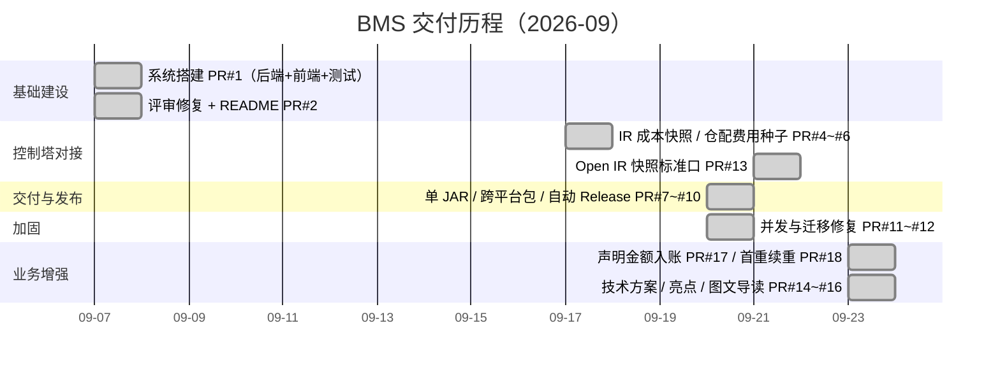
```mermaid
gantt
    title BMS 交付历程（2026-09）
    dateFormat  YYYY-MM-DD
    axisFormat  %m-%d
    section 基础建设
    系统搭建 PR#1（后端+前端+测试）        :done, 2026-09-07, 1d
    评审修复 + README PR#2                :done, 2026-09-07, 1d
    section 控制塔对接
    IR 成本快照 / 仓配费用种子 PR#4~#6     :done, 2026-09-17, 1d
    Open IR 快照标准口 PR#13              :done, 2026-09-21, 1d
    section 交付与发布
    单 JAR / 跨平台包 / 自动 Release PR#7~#10 :done, 2026-09-20, 1d
    section 加固
    并发与迁移修复 PR#11~#12               :done, 2026-09-20, 1d
    section 业务增强
    声明金额入账 PR#17 / 首重续重 PR#18    :done, 2026-09-23, 1d
    技术方案 / 亮点 / 图文导读 PR#14~#16   :done, 2026-09-23, 1d
```

| 阶段 | PR | 交付内容 |
| --- | --- | --- |
| 系统搭建 | #1 | 基础数据、合同费率、单据接入、计费引擎、对账结算、报表、前端 19 页、14 个流程测试、smoke |
| 评审修复 | #2、#11、#12 | 计费事务、并发幂等、余额行锁、唯一索引迁移、安全默认值、README |
| 控制塔对接 | #4、#5、#6、#13 | 成本快照查询、承运商编码、IR 标准快照口 |
| 交付发布 | #7、#8、#9、#10 | 单 JAR、Win/Mac/Linux 便携包、原生包（含 Apple Silicon）、自动 Release |
| 业务增强 | #17、#18 | 按声明金额入账运费差额与操作费、首重续重费率 |
| 文档 | #14、#15、#16 | 技术方案、项目亮点、图文导读 |

---

## 8. 运行与部署

| 方式 | 命令 / 说明 |
| --- | --- |
| 开发 | 后端 `mvn spring-boot:run`（8080，H2）；前端 `npm run dev`（5173，`/api` 代理到后端） |
| 单 JAR | `java -jar bms-backend-1.0.0.jar`，前端已打包内置，解压即用 |
| 便携包 / 原生包 | 从 GitHub Release 下载对应平台压缩包，双击启动脚本 |
| 生产 | MySQL 8，通过环境变量配置数据库连接、`BMS_ADMIN_PASSWORD`、`BMS_OPEN_API_KEY`、`BMS_AUTH_SECRET` |

---

## 9. 后续计划

| 方向 | 内容 | 优先级 |
| --- | --- | --- |
| 业务 | 燃油附加费、偏远地区加价等运输附加费规则；合同版本化与费率生效日期 | 高 |
| 业务 | 对账单导出（Excel/PDF）与客户在线确认 | 高 |
| 集成 | 与 OMS/WMS/TMS 联调真实单据，接入消息队列替代同步推送 | 中 |
| 财务 | 对接财务系统凭证；发票与税务系统对接 | 中 |
| 运维 | 操作审计报表、数据归档、性能压测 | 中 |
| 体验 | 报表图表化、批量操作、移动端查看 | 低 |

---

## 10. 小结

- 已交付一套**可运行、可部署、有测试、有文档**的计费结算系统，覆盖从业务单据到收付款核销的完整闭环。
- 与平台内 OMS/WMS/TMS **技术同构**，团队可无缝维护。
- 通过两轮代码评审加固了**并发、幂等、余额一致性**等财务系统关键点。
- 已为控制塔提供**只读成本口**，边界清晰：BMS 是唯一一本账。
